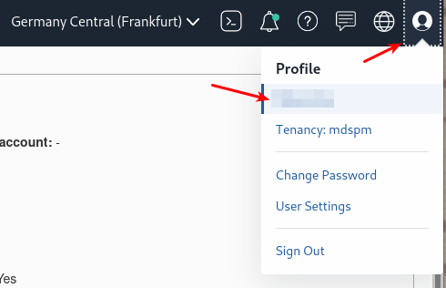
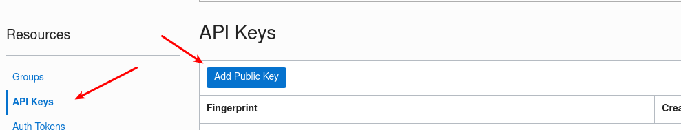
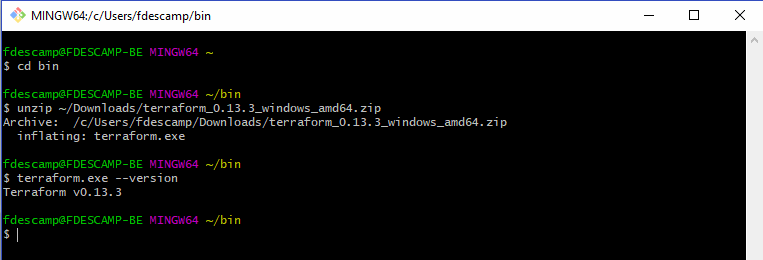

# Lab 2: Prepare your Oracle Cloud environment

## Overview

⏱️ _15-minutes_

In this lab, you will prepare your local machine and your Oracle Cloud API keys to run the rest of the Hands-on Lab.

 
## Create your API Keys

In this step, you will create your Oracle Cloud API keys. See [here](https://docs.cloud.oracle.com/en-us/iaas/Content/API/Concepts/apisigningkey.htm#two) for more details on API signing keys.

```
$ mkdir ~/.oci
$ openssl genrsa -out ~/.oci/oci_api_key.pem 2048
$ chmod go-rwx ~/.oci/oci_api_key.pem
$ openssl rsa -pubout -in ~/.oci/oci_api_key.pem -out ~/.oci/oci_api_key_public.pem
```

For Windows users, please use [Git for Windows](https://github.com/git-for-windows/git/releases/latest) that allows you to use bash and other GNU tools.


## Create your SSH Keys

In this step, you will generate your SSH Keys to allow secure connections from your machine to the servers we will create on OCI.

```
$ ssh-keygen -t rsa
Generating public/private rsa key pair.
Enter file in which to save the key (/home/fred/.ssh/id_rsa): id_rsa_oci
Enter passphrase (empty for no passphrase): 
Enter same passphrase again: 
Your identification has been saved in id_rsa_oci
Your public key has been saved in id_rsa_oci.pub
```


## Deploying the API Public Key


The API Key you created earlier needs to be linked to your OCI account: 





You need to upload the public key: `oci_api_key_public.pem`

## Installing Terraform

Terraform is proposed as a unique binary that you can download [here](https://www.terraform.io/downloads.html).

### For Linux users

```
$ cd ~bin
$ wget \
https://releases.hashicorp.com/terraform/0.13.2/terraform_0.13.2_linux_amd64.zip
$ unzip terraform_0.13.2_linux_amd64.zip 
Archive:  terraform_0.13.2_linux_amd64.zip
  inflating: terraform 
$ terraform --version
Terraform v0.13.2
``` 

### For Windows users



Congratulations, everything is now correctly set-up! You can proceed to the next lab…


