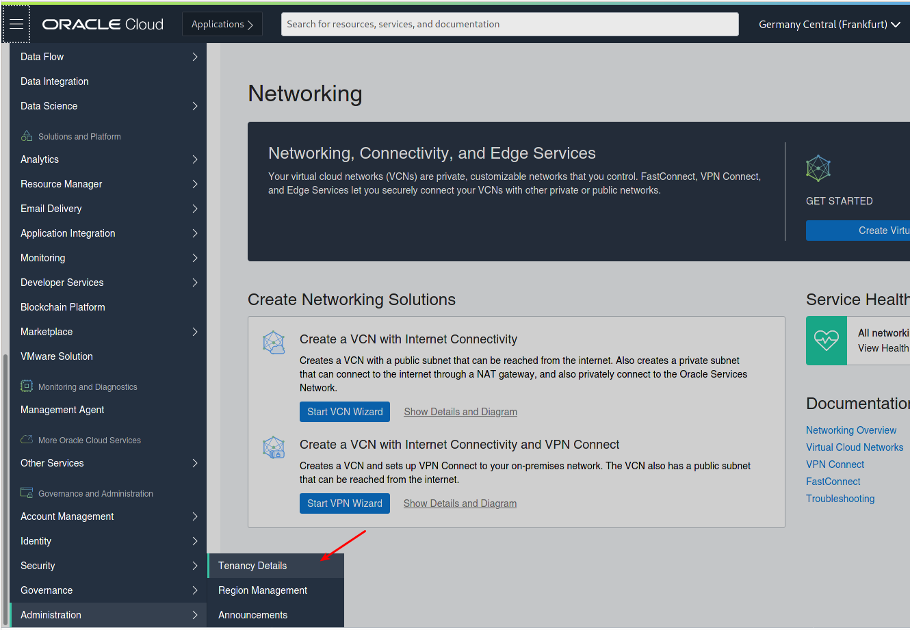
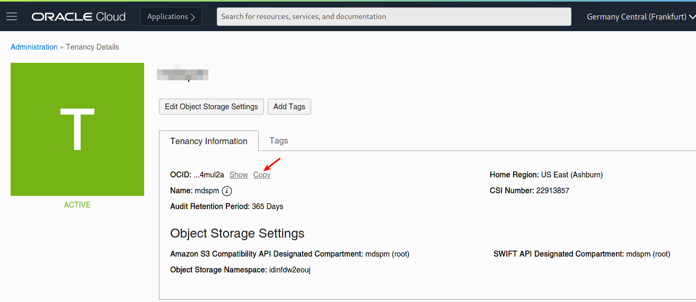
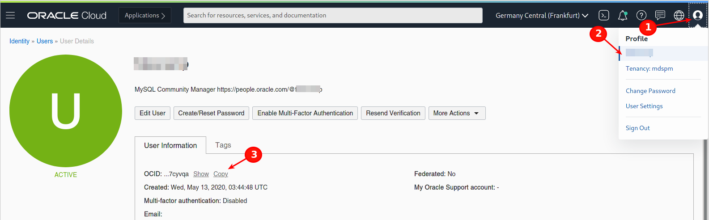
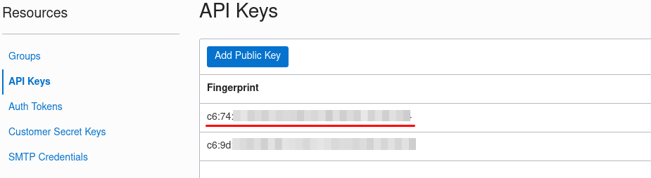
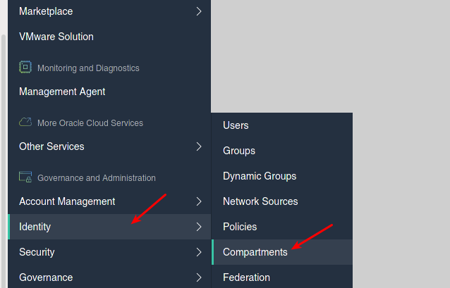
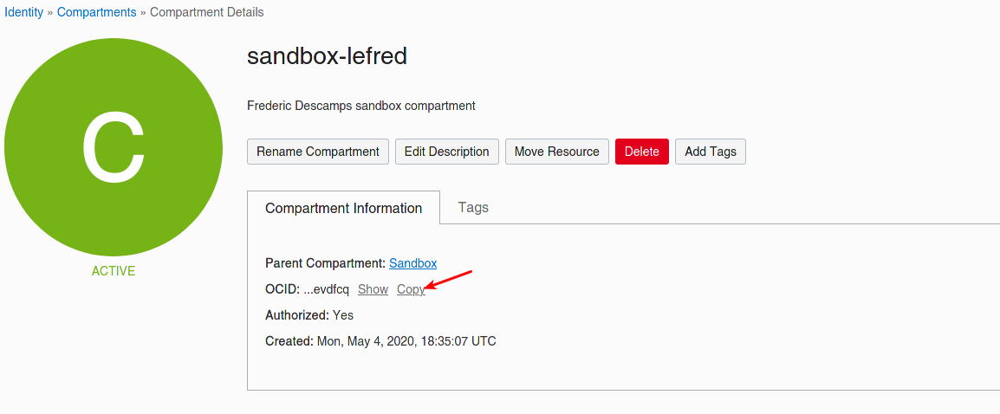
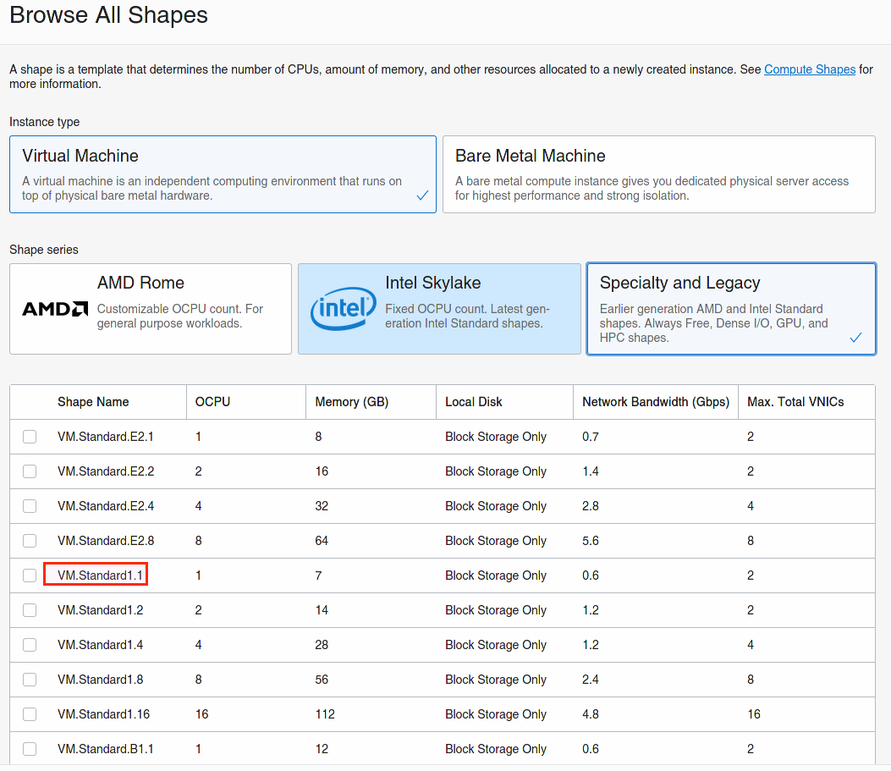

# Lab 3: Terraform Environment

## Overview

⏱️ _20-minutes_

In this lab, you will create retrieve the code for the Terraform infrastructure and learn how to configure it to use it with Oracle Cloud Infrastructure.

 
## Getting the code

The code to use with Terraform is located in github [here](https://github.com/lefred/oci-mysql-idc.git)

```
$ git clone https://github.com/lefred/oci-mysql-idc.git
```

💡 those commands need to be run in the **bash** console (from git for Windows) if you are using that operating system.

## Creating terraform.tfvars

The repository includes a template for `terraform.tfvars`, you can copy it to start editing it:

```
$ cd oci-mysql-idc
$ cp terraform.tfvars.template terraform.tfvars
``` 

We now have something like this: 

```
tenancy_ocid = "<REPLACE_ME>"
user_ocid = "<REPLACE_ME>"
fingerprint= "RE:PL:AC:E_:ME:__:RE:PL:AC:E_:ME:__:XX:XX:XX:XX"
private_key_path = "<REPLACE_ME>.pem"

region = "<REPLACE_ME>"

compartment_ocid = "<REPLACE_ME>"

ssh_authorized_keys_path = "<REPLACE_ME>"
ssh_private_key_path = "<REPLACE_ME>"

clusteradmin_password = "<REPLACE_ME>"
cluster_name = "MyClusterInOCI"

number_of_nodes = "3"

node_shape = "VM.Standard1.1"
```

## tenancy_ocid

You need to edit the new created `terraform.tfvars` file with required information to reach your OCI environment.

We start with the `tenancy_ocid`:

  



## user_ocid

We also need to provide the `user_ocid`:



## fingerprint and API Key

The private\_key\_path value is the path of oci\_api\_key.pem:

```
private_key_path = "/home/fred/.oci/oci_api_key.pem"
```

💡 On Windows relative paths seem to better work:

```
private_key_path = "../.oci/oci_api_key.pem"
```

The fingerprint is shown on OCI's dashboard:



## region

The region of your Free Trier account.

Examples:

```
region = "us-ashburn-1"
```

or 

```
region = "eu-frankfurt-1"
```

## compartment_ocid

You certainly not have any sandbox created, but in case you do, you can go down the compartment tree and pick to one you need. Today you only need to choose one:





## SSH Keys

You need to specify the keys that will allow you to connect in ssh to the compute instances (only via the bastion host to the MySQL InnoDB Cluster nodes).

Pay attention to provide the right path (absolute or private) and to verify that the private keys are those **without** .pub !

```
ssh_authorized_keys_path = "/home/fred/.ssh/id_rsa_oci.pub"
ssh_private_key_path = "/home/fred/.ssh/id_rsa_oci"
```

## Cluster Information

You need to provide some information related to the cluster:

* `clusteradmin_password`: the password for the user called `clusteradmin`. This is the user that will manage the cluster.

* `cluster_name`: a name for your cluster. In the slides we use **"MyClusterInOCI"**.

* `number_of_nodes`: the amount of nodes to deploy in your MySQL InnoDB Cluster. To achieve automatic HA, 3 nodes are required. For testing the deployment, only one is enough.


## Node Shape

Finally, you need to specify the Compute Instance's Shape. Of course it depends on your limits.

The different shapes can be found on OCI Dashboard:



You can get more info [here](https://docs.cloud.oracle.com/en-us/iaas/Content/Compute/References/computeshapes.htm).
