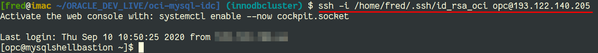
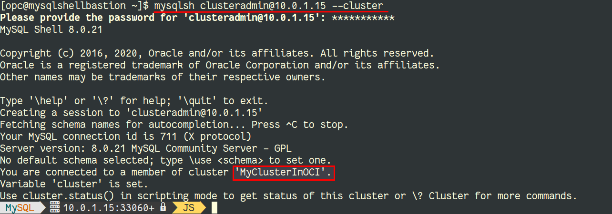
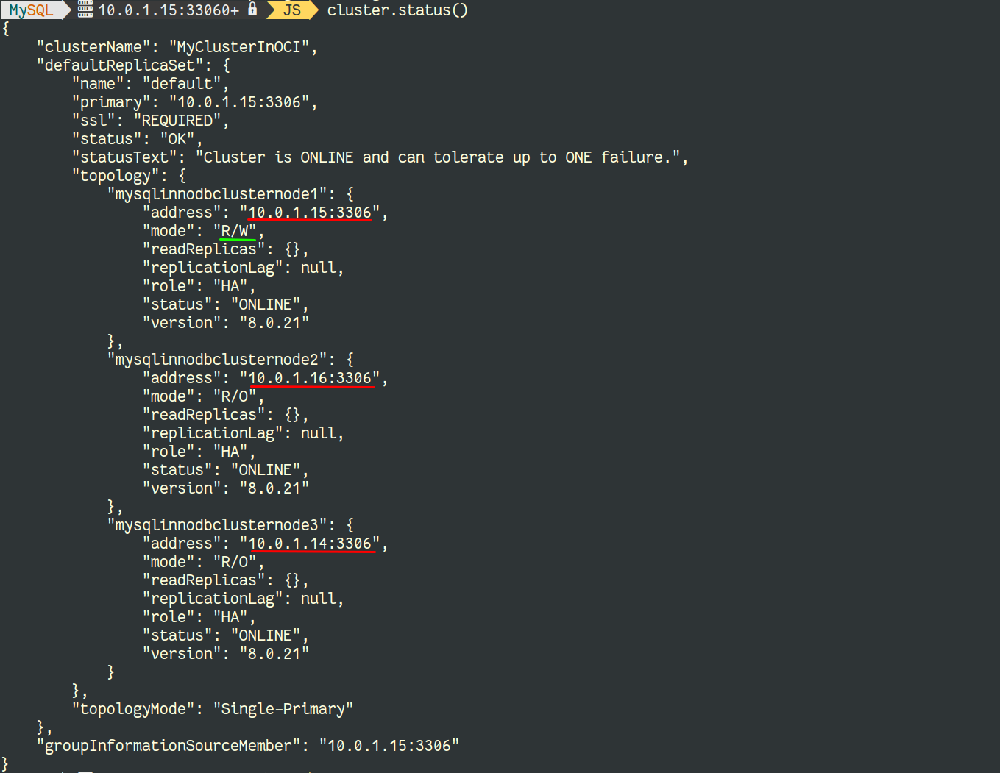
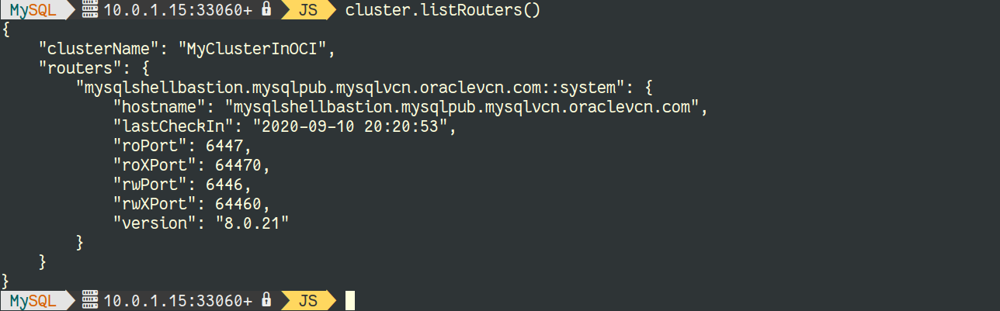

# Lab 5: MySQL InnoDB Cluster

## Overview

⏱️ _10-minutes_

In this lab, you will connect to the bastion host to check the status of your MySQL InnoDB Cluster.

## SSH to Bastion Host

To connect to the bastion host, we use ssh with the user **opc** on the public IP and the ssh key you created earliers.

💡 The public IP was returned by `terraform apply` and is also available on OCI's Dashboard when checking the Compute Instances.

## MySQL Shell

MySQL Shell is an advanced client and code editor for MySQL Server. It also allows you to manage a MySQL InnoDB Cluster via the [AdminAPI](https://dev.mysql.com/doc/dev/mysqlsh-api-python/8.0/group___admin_a_p_i.html).

When connected to the bastion host, you can use MySQL Shell (`mysqlsh`) with the `clusteradmin` user on one of the private IPs for your cluster nodes (see `terraform appy`'s output):

⚠️ please use your IPs, they should be in the range `10.0.1.0/24`.

## MySQL InnoDB Cluster - Status

You can now check the status of the cluster or the router, using `cluster.status()` and `cluster.listRouters()`:

