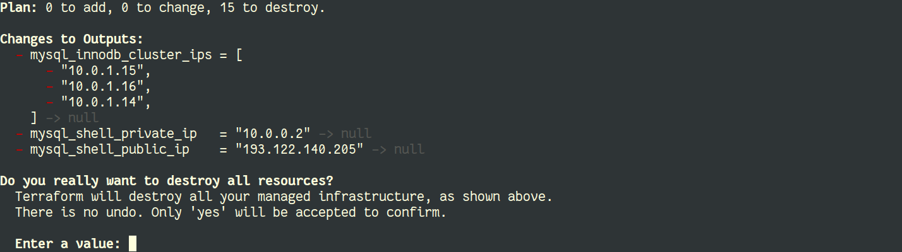
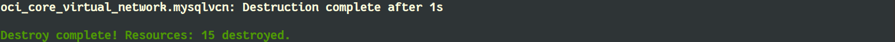

# Lab 6: Destroy

## Overview

⏱️ _2-minutes_ (but more waiting)

In this lab, we will clean up everything. We will terminate the full environment.

## Destroy

The `terraform destroy` command is used to destroy the Terraform-managed infrastructure. All resources will be terminated.

```
$ terraform destroy
```



