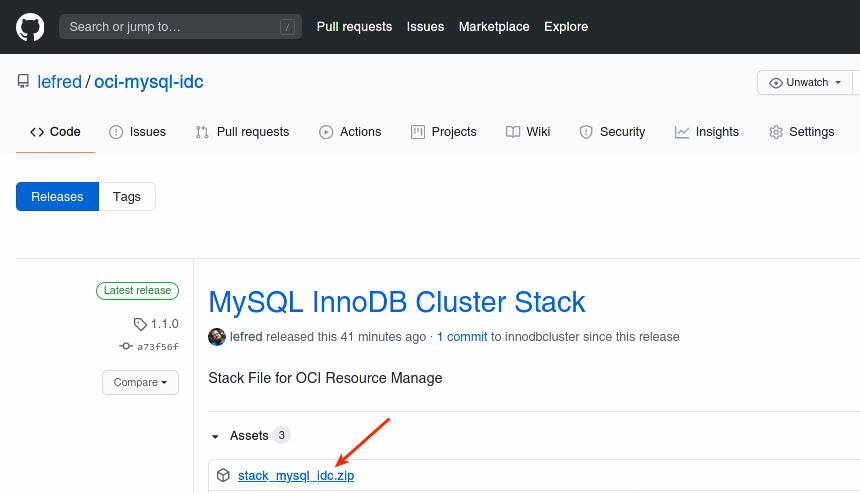
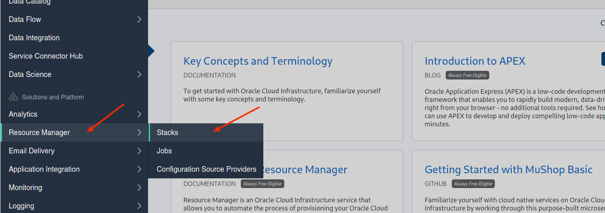
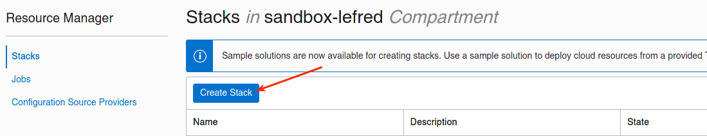
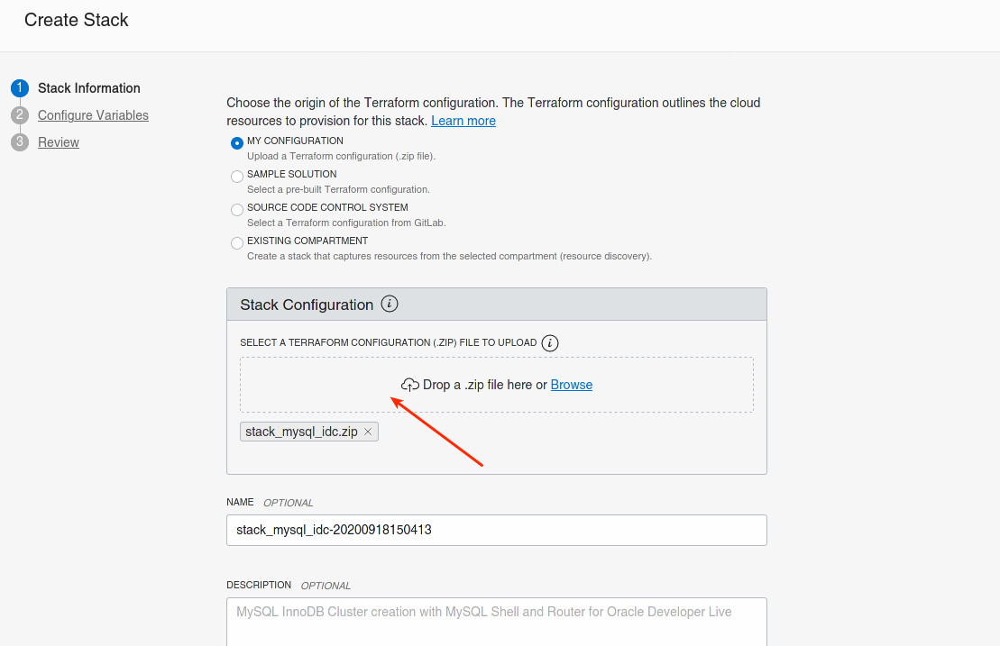
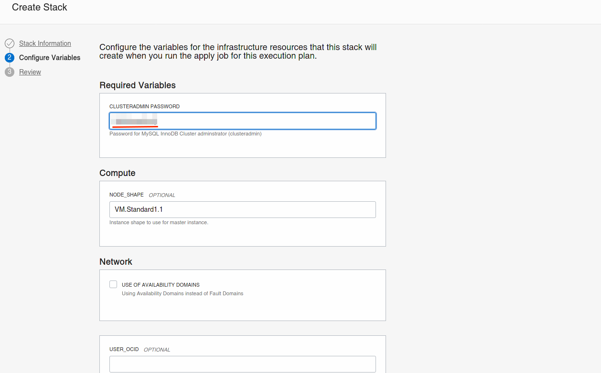
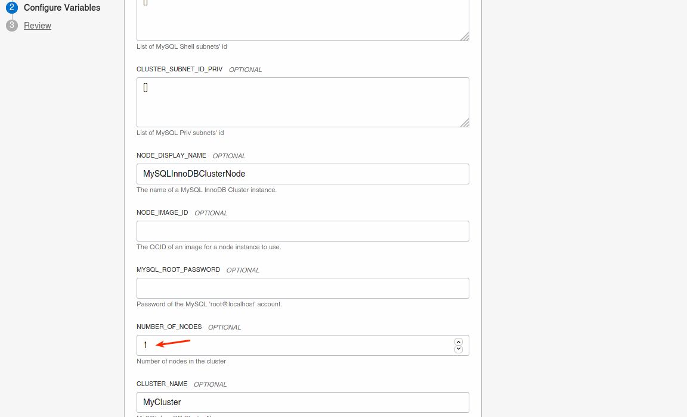
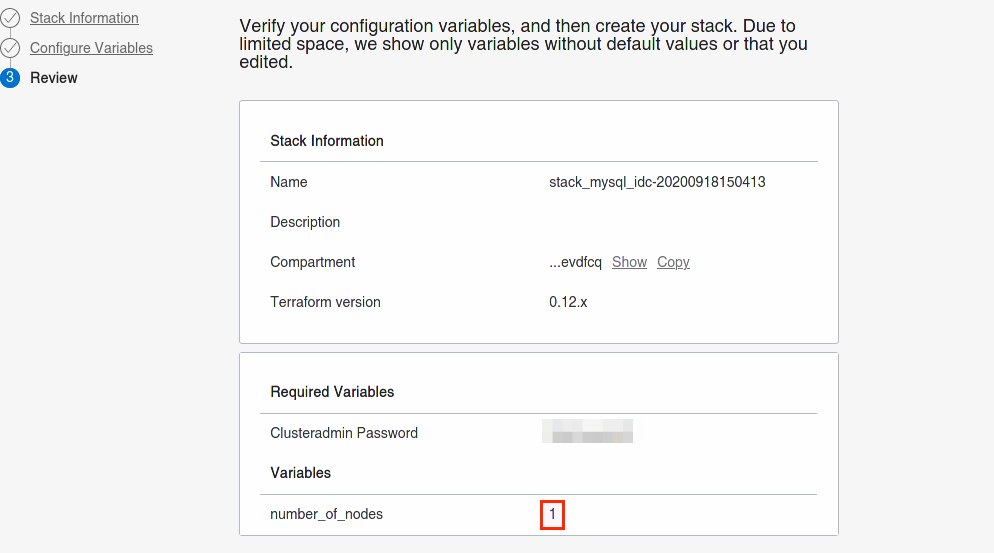
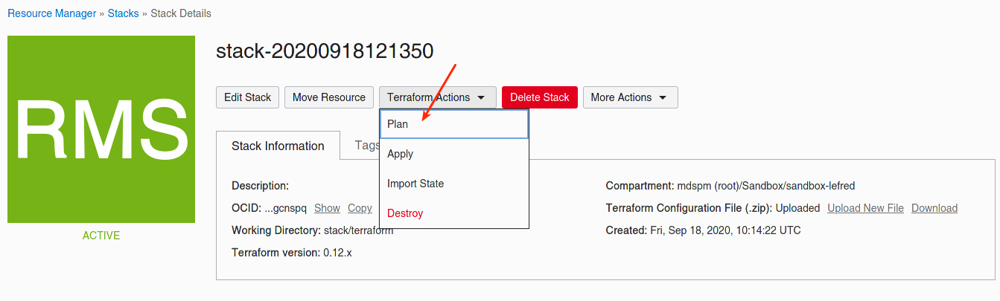
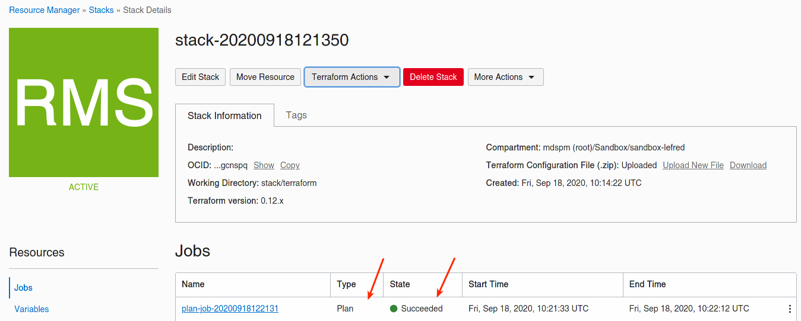
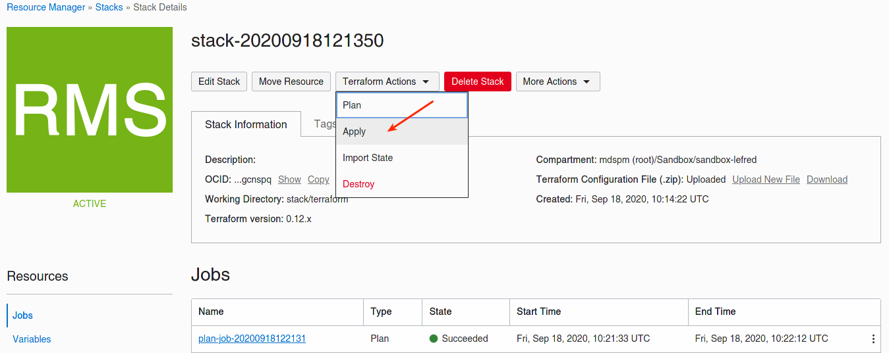

# Lab 7: Resource Manager - Stack

## Overview

⏱️ _10-minutes_ 

In this final lab, you will use OCI Resource Manager and deploy a stack to create a MySQL InnoDB Cluster.

## Download the stack

You need to download the stack package (zip file) and save it on your disk.

Download **`stack_mysql_idc.zip`** from [GitHub](https://github.com/lefred/oci-mysql-idc/releases/tag/1.1.0).



## Create the stack

Please go in OCI's dashboard and select **Resource Manager** and then **Stacks**:





Just drop here the zip file downloaded earlier:



Now you need to fill some variables:




## Plan

As Resource Manager is also using Terraform, you can plan the new created stack. This will create a new job:





## Apply

We can now apply our stack:



Logs are shown almost in realtime:



This time as we didn't enter any SSH key, the apply job will output one you have to use to connect to your bastion host:



## Connection

You can now copy the returned SSH private key and connect to the bastion host:

```
$ vi priv.key
<-- paste the content in the file and save it -->
$ chmod 600 priv.key
$ ssh -i priv.key opc@130.61.xx.xx
[opc@mysqlshellbastion ~]$
```

💡 The public IP was returned by the apply job and is also available on OCI's Dashboard when checking the Compute Instances. You can always returned to the output logs
of the job.

Thank you for attending this MySQL InnoDB Cluster & OCI hands-on lab.